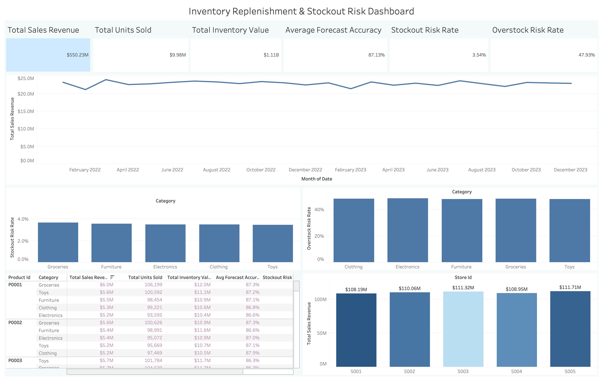

# Inventory Replenishment & Stockout Risk Dashboard

## Project Overview

This project analyzes retail inventory, sales, demand forecast, and store-level performance data to identify inventory planning issues such as stockout risk, overstock risk, forecast accuracy gaps, and product-level inventory exposure.

The purpose of this project is to simulate the type of analysis a supply chain analyst would perform when reviewing inventory health across products, categories, stores, and regions. Instead of only building charts, the project follows a full analytics workflow:

1. Clean the raw data using Python.
2. Create supply chain KPI fields.
3. Validate and analyze the data using SQL.
4. Build an executive dashboard to communicate business insights.
5. Translate the analysis into inventory planning recommendations.

This project was built as a portfolio project to demonstrate skills in supply chain analytics, SQL, Python, dashboard development, KPI design, and business communication.

---

## Business Problem

Retail companies need to balance two competing inventory risks:

- **Stockout risk:** Inventory is too low compared to expected demand.
- **Overstock risk:** Inventory is too high compared to expected demand.

Both problems are costly. Stockouts can lead to lost sales, lower customer satisfaction, and poor service levels. Overstock can tie up working capital, increase holding costs, and reduce inventory efficiency.

This project answers the following main business question:

> How can the business identify which products, stores, and categories need inventory planning attention based on sales performance, forecast accuracy, stockout risk, and overstock risk?

---

## Dataset

The dataset used in this project contains daily retail inventory records across multiple stores, products, categories, and regions.

### Main fields used

| Field | Description |
|---|---|
| `date` | Date of the inventory/sales record |
| `store_id` | Store identifier |
| `product_id` | Product identifier |
| `category` | Product category |
| `region` | Store region |
| `inventory_level` | Available inventory level |
| `units_sold` | Number of units sold |
| `units_ordered` | Number of units ordered |
| `demand_forecast` | Forecasted demand |
| `price` | Product selling price |
| `discount` | Discount level |
| `weather_condition` | Weather condition |
| `holiday_promotion` | Whether a holiday promotion was active |
| `competitor_pricing` | Competitor price |
| `seasonality` | Seasonality indicator |

### Dataset size

| Metric | Value |
|---|---:|
| Total records | 73,100 |
| Date range | 2022-01-01 to 2024-01-01 |
| Number of stores | 5 |
| Number of products | 20 |
| Number of categories | 5 |
| Number of regions | 4 |

---

## Notable analysis highlights

These are a small set of **extra metrics** from SQL validation and rollups that are useful for context. They complement the headline KPIs in [Business Questions and Answers](#business-questions-and-answers); they are not a full metric catalog.

| Highlight | Value / takeaway |
|---|---|
| Duplicate `date` × `store_id` × `product_id` rows | **0** (each store–product–day appears once) |
| Category mix at row level | About **20%** of rows per category (five categories between **19.9%** and **20.1%**), so category representation is even in this dataset |
| Zero-sales rows | About **0.49%** of rows have `units_sold` = 0 (**360** rows); inventory coverage is left blank there by design |
| Overstock vs stockout (same row-level definitions as the dashboard) | Overstock risk rate (**~48%**) is about **13.5×** the stockout risk rate (**~3.5%**) |
| ABC classification (product × category) | **100** combinations: **78** Class A, **16** Class B, **6** Class C by cumulative sales revenue |

Category-level stockout and overstock rates sit in a tight band (about **3.5%–3.7%** stockout and **47.7%–48.2%** overstock by category in the rollup exports), so the overstock story is **portfolio-wide**, not driven by one outlier category.

---

## Tools Used

| Tool | Purpose |
|---|---|
| Python | Data cleaning, feature engineering, KPI creation |
| pandas | Data manipulation and transformation |
| NumPy | Numerical calculations |
| SQLite | Local SQL database and analysis |
| SQL | Data validation, KPI analysis, ABC classification |
| Tableau | Dashboard development and business visualization |
| Cursor | Main coding environment |
| GitHub | Project documentation and version control |

---

## Project Workflow

The project follows this workflow:

```text
Raw CSV Data
→ Python Data Cleaning
→ KPI Field Creation
→ SQLite Database Creation
→ SQL Data Validation
→ SQL Business Analysis
→ Tableau Dashboard
→ Business Insights and Recommendations
```

## Project Folder Structure

```text
inventory-replenishment-dashboard/
│
├── data/
│   ├── raw/
│   │   └── retail_inventory.csv
│   ├── processed/
│   │   └── cleaned_retail_inventory.csv
│   └── processed/tableau_outputs/
│       ├── category_summary.csv
│       ├── product_summary.csv
│       ├── monthly_summary.csv
│       ├── store_summary.csv
│       ├── abc_analysis.csv
│       └── full_inventory_data.csv
│
├── database/
│   └── inventory.db
│
├── notebook/
│   └── 01_data_exploration.ipynb
│
├── sql/
│   ├── 01_create_database.py
│   ├── 02_data_validation.sql
│   ├── 03_inventory_kpi_analysis.sql
│   ├── 04_abc_analysis.sql
│   ├── 05_tableau_export_queries.sql
│   └── export_tableau_outputs.py
│
├── tableau/
│   └── dashboard screenshots or Tableau workbook
│
├── reports/
│   └── final dashboard images or PDF summary
│
├── .gitignore
└── README.md
```
## Dashboard Preview



## KPI Definitions

Several new KPI fields were created in Python to support the inventory analysis.

### Sales Revenue

`sales_revenue = units_sold × price`

This measures how much revenue each product-store-date record generated.

### Inventory Value

`inventory_value = inventory_level × price`

This estimates how much value is currently tied up in inventory.

### Forecast Error

`forecast_error = units_sold - demand_forecast`

This compares actual sales against forecasted demand.

### Absolute Forecast Error

`abs_forecast_error = absolute value of forecast_error`

This measures forecast error size regardless of whether the forecast was too high or too low.

### Forecast Accuracy

`forecast_accuracy = 1 - (abs_forecast_error / demand_forecast)`

This estimates how close the demand forecast was to actual units sold.

### Inventory Coverage Ratio

`inventory_coverage_ratio = inventory_level / units_sold`

This gives a rough estimate of how much inventory is available relative to sales volume.

### Stockout Risk

`stockout_risk = 1 if inventory_level < demand_forecast, else 0`

This flags records where available inventory is below forecasted demand.

### Overstock Risk

`overstock_risk = 1 if inventory_level > demand_forecast × 2, else 0`

This flags records where inventory is more than twice forecasted demand.

### Order-Sales Gap

`order_sales_gap = units_ordered - units_sold`

This compares ordered units against sold units. A negative value means sales exceeded units ordered during the selected period.

---

## Business Questions and Answers

### 1. What is the overall sales and inventory performance?

The business generated approximately:

| KPI | Value |
|---|---|
| Total Sales Revenue | $550.23M |
| Total Units Sold | 9.98M |
| Total Inventory Value | $1.11B |
| Average Forecast Accuracy | 87.13% |
| Stockout Risk Rate | 3.54% |
| Overstock Risk Rate | 47.93% |

**Answer**

The business has strong total sales volume and relatively solid forecast accuracy. However, overstock risk is much higher than stockout risk. This suggests that the larger inventory planning issue is not widespread shortage, but excess inventory exposure.

### 2. Is revenue stable over time?

The Monthly Sales Trend shows that revenue stays relatively stable across most months in the dataset.

**Answer**

Monthly revenue does not show major volatility. This suggests that the business has consistent demand patterns across the analyzed time period. However, incomplete months should be excluded from the final dashboard to avoid misleading drops at the end of the timeline.

### 3. Which categories have the highest stockout risk?

The Stockout Risk by Category chart compares the percentage of product-store-day records where inventory level is below forecasted demand.

**Answer**

Stockout risk is relatively low across categories, with the overall stockout risk rate around 3.54%. This means stockout exposure exists, but it is not the dominant inventory issue in the dataset.

The business should still monitor categories with slightly higher stockout risk because even a low stockout rate can be costly for high-revenue products.

### 4. Which categories have the highest overstock risk?

The Overstock Risk by Category chart compares the percentage of records where inventory level is more than twice forecasted demand.

**Answer**

Overstock risk is much higher than stockout risk across the product portfolio. The overall overstock risk rate is approximately 47.93%, meaning a large share of records show inventory levels materially above forecasted demand.

This suggests possible excess purchasing, weak replenishment rules, conservative inventory policies, or demand forecasts that are not fully aligned with inventory decisions.

### 5. Which products need the most inventory planning attention?

The Product Performance Table compares products by:

- Sales revenue
- Units sold
- Inventory value
- Forecast accuracy
- Stockout risk rate
- Overstock risk rate
- Product risk status

**Answer**

Products should not be prioritized based on stockout or overstock risk alone. A product with high risk and high revenue deserves more attention than a product with high risk but low business impact.

The table helps identify products that have:

- High revenue and high stockout risk
- High inventory value and high overstock risk
- Lower forecast accuracy
- Mixed risk patterns

This supports better product-level inventory review.

### 6. What does the product risk status mean?

The Product Risk Status field classifies products into groups such as:

| Risk Status | Meaning |
|---|---|
| Mixed Risk | Product has both meaningful stockout and overstock exposure |
| Moderate Overstock Risk | Product has noticeable overstock exposure |
| Stable | Product does not cross major risk thresholds |

**Answer**

The product portfolio does not show widespread extreme stockout risk. Instead, many products fall into stable, mixed-risk, or moderate-overstock categories. This suggests the main issue is inventory imbalance rather than simple understocking or overstocking.

### 7. Which stores perform best?

The Store Performance chart compares store-level sales revenue and uses overstock risk as the color indicator.

**Answer**

The store performance view helps compare which stores generate the most revenue while also showing whether any stores have higher overstock exposure.

This is useful because a store can perform well in sales but still carry too much inventory. The business should review stores that combine high revenue with elevated overstock risk because those locations may have the greatest working-capital impact.

### 8. Which products or product-category combinations are most important?

ABC analysis was used to classify product-category combinations based on sales revenue contribution.

**Answer**

ABC classification helps identify which product-category combinations contribute the most to total revenue. These high-priority items should receive closer planning attention because errors in replenishment or forecasting have a larger business impact.

For this project, ABC classification was based on sales revenue because the dataset does not include true unit cost or annual consumption cost.

---

## ABC Analysis Explanation

ABC analysis is an inventory management method used to classify products based on business value.

A common rule is:

| Class | Meaning |
|---|---|
| A | Highest-value items that drive most revenue |
| B | Medium-priority items |
| C | Lower-value items |

In this project, ABC analysis is based on cumulative sales revenue contribution.

The method helps answer:

> Which product-category combinations should inventory planners focus on first?

This matters because not every product deserves the same level of monitoring. A high-revenue product with inventory risk should usually receive more attention than a low-revenue product with the same risk level.

---

## Dashboard Design

The final dashboard focuses on executive readability instead of showing every possible chart.

### Main dashboard sections

- Executive KPI cards
- Monthly Sales Trend
- Stockout Risk by Category
- Overstock Risk by Category
- Product Performance Table
- Store Performance

### Dashboard purpose

The dashboard is designed to help users quickly answer:

- Is revenue stable?
- Is forecast accuracy acceptable?
- Is stockout risk high or low?
- Is overstock risk a bigger problem?
- Which categories need attention?
- Which products should be reviewed first?
- Which stores carry stronger revenue and inventory exposure?

### Key Dashboard Insight

The main insight from the dashboard is:

> Sales revenue and forecast accuracy are relatively stable, while overstock risk is substantially higher than stockout risk. Inventory review should focus on high-revenue products, product-category combinations, and stores with elevated overstock exposure.

This means the business should not only focus on preventing stockouts. It should also review whether inventory levels are too high compared to forecasted demand.

---

## SQL Analysis

SQL was used to validate the dataset and create business-ready analysis outputs.

### SQL files

| File | Purpose |
|---|---|
| `01_create_database.py` | Loads the cleaned CSV into a SQLite database |
| `02_data_validation.sql` | Validates row count, date range, dimensions, duplicates, and missing values |
| `03_inventory_kpi_analysis.sql` | Creates inventory KPI analysis by category, product, store, and month |
| `04_abc_analysis.sql` | Creates ABC classification based on revenue contribution |
| `05_tableau_export_queries.sql` | Creates summary tables for dashboarding |
| `export_tableau_outputs.py` | Exports SQL outputs to CSV files for Tableau |

### Data validation results

| Check | Result |
|---|---|
| Total rows | 73,100 |
| Date range | 2022-01-01 to 2024-01-01 |
| Stores | 5 |
| Products | 20 |
| Categories | 5 |
| Regions | 4 |
| Duplicate records | 0 |
| Missing inventory coverage rows | 360 |

The missing inventory coverage values are caused by rows where `units_sold` is zero. Since dividing by zero would not be meaningful, those values were left blank.

---

## Tableau Dashboard Components

### 1. Executive KPI Cards

Shows the main business summary:

- Total Sales Revenue
- Total Units Sold
- Total Inventory Value
- Average Forecast Accuracy
- Stockout Risk Rate
- Overstock Risk Rate

### 2. Monthly Sales Trend

Shows revenue movement over time and helps identify whether sales are stable, seasonal, or volatile.

### 3. Stockout Risk by Category

Shows which product categories are more likely to have inventory below forecasted demand.

### 4. Overstock Risk by Category

Shows which product categories are more likely to hold inventory above twice forecasted demand.

### 5. Product Performance Table

Compares product-level revenue, inventory value, forecast accuracy, stockout risk, and overstock risk.

### 6. Store Performance

Compares store-level revenue while using overstock risk as a color indicator.

### 7. ABC Product-Category Classification

Classifies product-category combinations based on revenue contribution to identify planning priorities.

---

## Business Recommendations

Based on the analysis, the business should consider the following actions:

1. **Prioritize overstock reduction** — Overstock risk is much higher than stockout risk. The business should review categories and products with high overstock rates and high inventory value.

2. **Review high-revenue products first** — Inventory planning should prioritize high-revenue products and product-category combinations because those have greater business impact.

3. **Monitor mixed-risk products** — Some products may show both stockout and overstock exposure. These products may have inconsistent inventory positioning across stores, regions, or time periods.

4. **Improve replenishment rules** — The business should review whether replenishment quantities are too conservative or not aligned with forecasted demand.

5. **Use forecast accuracy as an early warning signal** — Products with lower forecast accuracy should be reviewed because poor forecasting can lead to either stockouts or overstock.

6. **Investigate store-level inventory exposure** — Stores with high revenue and high overstock risk should be prioritized because they may tie up more working capital.

---

## Project Limitations

This project is useful for inventory risk analysis, but it is not a full replenishment optimization model.

The dataset does not include:

- Supplier names
- Supplier lead time
- Unit cost
- Holding cost
- Service-level targets
- Purchase order timing
- Warehouse/bin location
- Backorders
- True lost sales
- Beginning and ending inventory balances

Because of these limitations, the dashboard identifies inventory risk and prioritization opportunities, but it does not calculate exact reorder quantities or optimal safety stock.

---

## Future Improvements

If more data were available, this project could be expanded to include:

- Supplier lead-time analysis
- Safety stock calculation
- Reorder point calculation
- Economic Order Quantity analysis
- Carrying cost estimation
- Gross margin analysis
- Lost sales estimation
- Supplier performance dashboard
- Warehouse-level inventory accuracy
- Demand forecasting model comparison

---

## What I Learned

Through this project, I practiced building a complete analytics workflow from raw data to dashboard insights.

The most important things I learned were:

- How to clean and prepare inventory data using Python
- How to create supply chain KPI fields
- How to use SQL for validation and business analysis
- How to think about stockout risk and overstock risk
- How ABC analysis helps prioritize inventory decisions
- How to design a dashboard around business questions instead of just charts
- How to communicate technical results in a way that supports business decisions

---

## How to Run This Project

### 1. Clone the repository

```bash
git clone <your-repository-url>
cd inventory-replenishment-dashboard
```

### 2. Install required Python libraries

```bash
pip install pandas numpy
```

### 3. Place the raw dataset in the raw data folder

`data/raw/retail_inventory.csv`

### 4. Run the data cleaning notebook

`notebook/01_data_exploration.ipynb`

This creates:

`data/processed/cleaned_retail_inventory.csv`

### 5. Create the SQLite database

```bash
python sql/01_create_database.py
```

### 6. Run SQL validation and analysis

```bash
sqlite3 database/inventory.db < sql/02_data_validation.sql
sqlite3 database/inventory.db < sql/03_inventory_kpi_analysis.sql
sqlite3 database/inventory.db < sql/04_abc_analysis.sql
sqlite3 database/inventory.db < sql/05_tableau_export_queries.sql
```

### 7. Export Tableau-ready CSV files

```bash
python sql/export_tableau_outputs.py
```

### 8. Open Tableau

Connect Tableau to:

`data/processed/tableau_outputs/full_inventory_data.csv`

Use the exported summary files if needed for additional dashboard sheets.

---

## Final Project Summary

This project analyzes inventory performance across products, categories, stores, and time periods. The analysis shows that the business has stable revenue and solid forecast accuracy, but overstock risk is much higher than stockout risk.

The final dashboard helps identify where inventory review should be prioritized by combining revenue, inventory value, forecast accuracy, stockout risk, overstock risk, product performance, store performance, and ABC classification.

This project demonstrates how Python, SQL, and Tableau can be used together to support supply chain decision-making.

* * *

## 📬 Contact

**Toan Le**  
- 📧 Email: [nguyenphutoanle@gmail.com](mailto:nguyenphutoanle@gmail.com?subject=Customer%20Segmentation%20%26%20ROI%20Playbooks%20%28dunnhumby%29%20%F0%9F%93%8A)
- 💼 LinkedIn: https://www.linkedin.com/in/toanle02/  
- 🧑‍💻 GitHub: https://github.com/Twon02  

**Questions about this project? Please open an **Issue** in this repo instead of emailing—this keeps discussion transparent and searchable.**

*This project is for educational/portfolio use only — not investment advice.*
